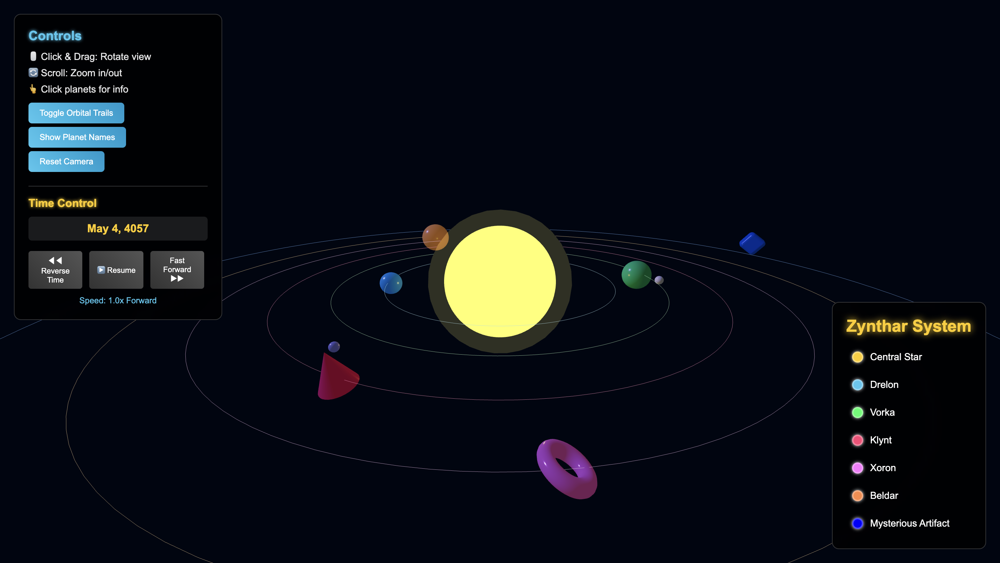

# Enhanced Fictional Orbital System 30 June 2025



## Developer
**ADA University**  
Computer Graphics (CSCI-2408 - 30044)  
Summer 2025  
Rufat Ismayilov  
Elvin Azizli  
ID: P000015727

## Overview

This is a 3D interactive orbital system visualization built with Three.js and Vite. The project creates an immersive space environment featuring a fictional solar system called "Zynthar System" with multiple planets, enhanced lighting, shadows, and an interactive UI overlay. The application renders celestial bodies with realistic orbital mechanics and provides an engaging user experience through camera controls and visual effects.

## System Architecture

### Frontend Architecture
- **Framework**: Vanilla JavaScript with Three.js for 3D rendering
- **Build Tool**: Vite for development server and bundling
- **Rendering Engine**: WebGL through Three.js with enhanced features including shadows, tone mapping, and anti-aliasing
- **Module System**: ES6 modules with dynamic imports

### Project Structure
```
/src/
  ├── index.html      # Main HTML entry point with UI overlay
  ├── script.js       # Main Three.js application logic
  └── style.css       # UI styling and layout
/static/              # Static assets directory
/dist/                # Build output directory
vite.config.js        # Vite configuration
package.json          # Project dependencies and scripts
```

## Key Components

### 3D Scene Components
1. **Scene Management**: Three.js scene with enhanced background and lighting
2. **Camera System**: Perspective camera with orbital controls and constraints
3. **Rendering Pipeline**: WebGL renderer with shadow mapping, tone mapping, and anti-aliasing
4. **Lighting System**: Multi-light setup including ambient and point lights

### Celestial Bodies
- **Central Star**: Primary light source with point light emission
- **Planets**: Multiple unique geometries (spheres, cones, torus) representing different worlds
- **Visual Diversity**: Each celestial body has distinct colors and geometric properties

### User Interface
- **System Information Panel**: Left-side overlay displaying planet list with color indicators
- **Interactive Planet List**: Clickable planet entries for potential future interactions
- **Controls Information**: User guidance for navigation
- **Responsive Design**: Glass-morphism styling with backdrop blur effects

### Control System
- **Orbit Controls**: Mouse/touch interaction for camera movement
- **Damping**: Smooth camera transitions with momentum
- **Constraints**: Distance and angle limitations for optimal viewing

## Data Flow

1. **Initialization**: Vite loads and bundles the application
2. **Scene Setup**: Three.js initializes the 3D environment with lighting and camera
3. **Object Creation**: Celestial bodies are instantiated with unique properties
4. **Render Loop**: Continuous rendering cycle updates the scene
5. **User Interaction**: Orbit controls capture input and update camera position
6. **UI Updates**: Interface elements remain synchronized with 3D scene state

## External Dependencies

### Core Dependencies
- **Three.js (^0.177.0)**: 3D graphics library for WebGL rendering
  - OrbitControls: Camera interaction controls
  - RoundedBoxGeometry: Enhanced geometric shapes
- **Vite (^6.3.5)**: Build tool and development server

### Development Features
- Hot module replacement for rapid development
- Source maps for debugging
- Optimized production builds with tree shaking

## Deployment Strategy

### Development Environment
- Vite development server on port 5000
- Host configuration for external access (0.0.0.0)
- Auto-opening browser for immediate feedback

### Production Build
- Static site generation to `/dist` directory
- Source map generation for debugging
- Asset optimization and minification
- Relative path configuration for flexible deployment

### Build Commands
```bash
npm run dev    # Development server
npm run build  # Production build
```

## User Preferences

Preferred communication style: Simple, English language.
