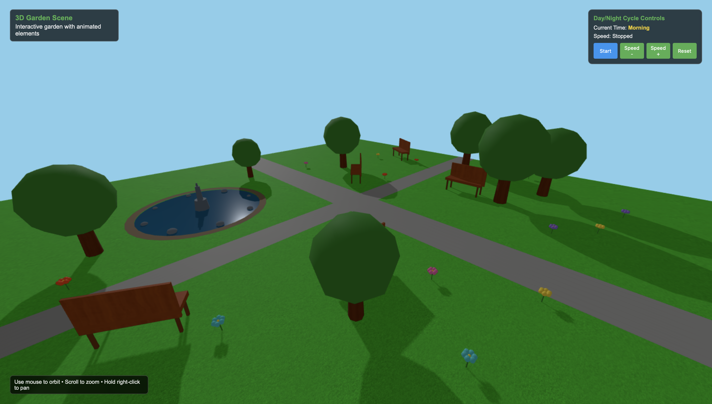

# Enhanced 3D Garden Scene Project 4 July 2025



## Developer

**ADA University**  
Computer Graphics (CSCI-2408 - 30044)  
Summer 2025  
Rufat Ismayilov  
Elvin Azizli  
ID: P000015727

## Overview

This is a full-stack 3D garden visualization application built with Express.js backend and React frontend. The project creates an immersive garden environment featuring interactive 3D elements, realistic lighting, and dynamic animations. The application combines modern web development practices with advanced 3D graphics to provide an engaging user experience through camera controls, material rendering, and environmental effects.

## System Architecture

### Frontend Architecture

- **Framework**: React 18 with JavaScript for component-based UI development
- **Build Tool**: Vite for development server and optimized production builds
- **3D Graphics**: Three.js with React Three Fiber for WebGL rendering and scene management
- **Styling**: Tailwind CSS with custom design system and responsive layouts
- **UI Components**: Radix UI primitives with shadcn/ui for accessible component library
- **State Management**: Zustand for lightweight application state management

### Backend Architecture

- **Framework**: Express.js with JavaScript for server-side logic
- **Database**: PostgreSQL with Drizzle ORM for type-safe database operations
- **Database Provider**: Neon Database for serverless PostgreSQL hosting
- **Session Management**: PostgreSQL-based session storage for user persistence
- **Module System**: ES Modules for modern JavaScript architecture

### Project Structure

```
/src/
  ├── frontend/
  │   ├── components/     # React components and UI elements
  │   ├── scenes/         # Three.js 3D scene configurations
  │   ├── styles/         # Tailwind CSS and styling
  │   └── utils/          # Utility functions and helpers
  ├── backend/
  │   ├── routes/         # Express API routes
  │   ├── models/         # Database models and schemas
  │   └── middleware/     # Authentication and session handling
  /static/                # Static assets and textures
  /dist/                  # Build output directory
  vite.config.js          # Vite configuration
  package.json            # Project dependencies and scripts
```

## Key Components

### 3D Scene Components

1. **Scene Management**: Three.js scene with enhanced garden environment and atmospheric effects
2. **Camera System**: Perspective camera with orbital controls and smooth navigation constraints
3. **Rendering Pipeline**: WebGL renderer with shadow mapping, anti-aliasing, and PBR materials
4. **Lighting System**: Multi-light setup with ambient and directional lighting for realistic shadows

### Garden Elements

- **Interactive Objects**: Trees, flowers, and garden structures with realistic materials
- **Animations**: Swaying trees, water ripples, and environmental particle effects
- **Textures**: High-quality material textures for enhanced visual realism
- **Environmental Effects**: Dynamic lighting changes and atmospheric elements

### Control System

- **Orbit Controls**: Mouse/touch interaction for camera movement with smooth damping
- **Zoom Constraints**: Distance limitations for optimal garden viewing experience
- **Pan Controls**: Horizontal and vertical camera movement with boundary restrictions

## External Dependencies

### Core Dependencies

- **Three.js (^0.177.0)**: 3D graphics library for WebGL rendering and scene management
  - React Three Fiber: React renderer for Three.js integration
  - OrbitControls: Camera interaction and navigation controls
- **React (^18.0.0)**: Component-based UI library for frontend development
- **Express.js (^4.18.0)**: Web application framework for backend API development
- **Drizzle ORM**: Type-safe database operations and schema management

### UI and Styling Dependencies

- **Tailwind CSS**: Utility-first CSS framework for responsive design
- **Radix UI**: Accessible component primitives for consistent UI elements
- **Zustand**: Lightweight state management for React applications

### Development Dependencies

- **Vite (^6.3.5)**: Fast build tool and development server with hot reload
- **ESBuild**: Fast JavaScript bundler for optimized production builds
- **PostCSS**: CSS processing and optimization for enhanced performance

## Deployment Strategy

### Development Environment

- Vite development server with hot module replacement for rapid development
- Express backend server with automatic restart on file changes
- PostgreSQL database connection for local development and testing
- Source maps enabled for debugging Three.js and React components

### Production Build

- Frontend build process generates optimized static assets to `/dist/public`
- Backend compilation produces single executable file at `/dist/index.js`
- Database migrations automatically applied through Drizzle ORM
- Asset optimization includes code splitting and tree shaking

### Build Commands

```bash
npm run dev          # Development servers
npm run build        # Production build for both frontend and backend
npm run preview      # Preview production build locally
```

## Recent Updates

July 4, 2025 - Successfully implemented complete 3D garden scene with Three.js  
Fixed canvas rendering issues by correcting DOM element paths  
Added interactive camera controls with OrbitControls for smooth navigation  
Implemented realistic PBR materials, textures, and environmental lighting  
Created animated garden elements including swaying trees and water ripples  
Added comprehensive error handling and texture loading callbacks for stability

## User Preferences
Preferred communication style: English language.
